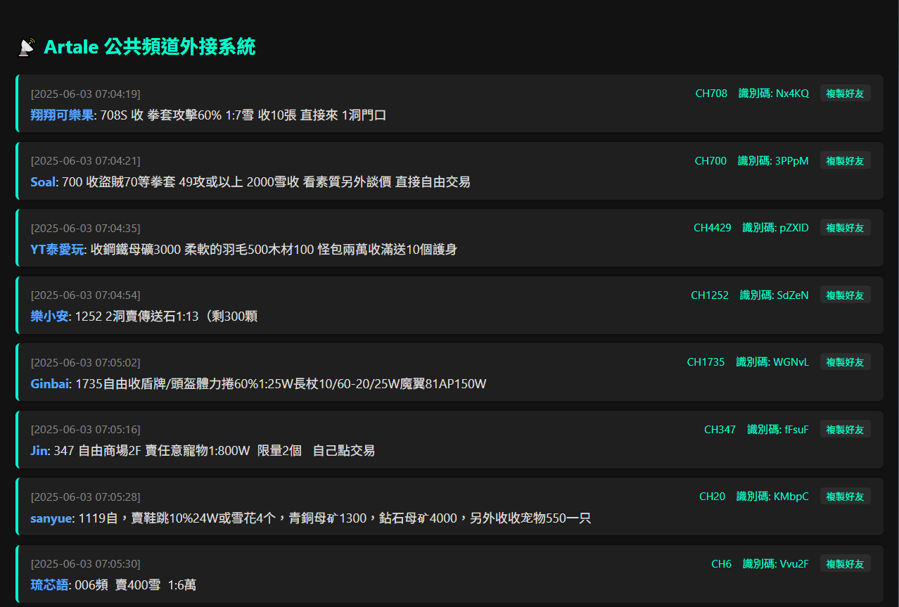

# Artale Channel Broadcast System（公共頻道外接系統）

🎮 用於楓之谷 Artale 伺服器的公共聊天訊息外接系統。透過封包分析，自動解析 TCP 封包中的頻道、暱稱、訊息等資訊，並以 WebSocket 推播給網頁前端顯示。可用於自動顯示聊天、建立好友、整合直播視覺化。

---

## ✅ 功能特色

- 📦 即時封包監聽（TCP port `32800`）
- 🔍 精準解析欄位：`Channel`、`Nickname`、`UserId`、`Text`、`ProfileCode`
- 🧠 自動產生好友標籤格式：`Nickname#UserId`
- 🕒 附加時間戳（`[YYYY-MM-DD HH:MM:SS]`）
- 🌐 透過 WebSocket 推播至前端網頁
- ✨ 支援複製好友資訊、彈性美化 UI

---

## 🔮 未來預計功能

* 💾 儲存聊天紀錄至資料庫（本地或遠端）
* 🔍 支援關鍵字快速搜尋（如：背包、賣、買）
* 📈 建立歷史價格紀錄與交易統計分析
* 🧭 Web 前端整合搜尋列、時間範圍與排序工具
---

## 🚀 安裝與啟動

### 1. 安裝 Python 套件

```bash
pip install scapy websockets
````

### 2. 啟動封包監聽 + WebSocket 廣播主程式

```bash
python main_chat_ws.py
```

啟動後你將看到：

```
>> 🟢 啟動 Sniffer 中（tcp port 32800） ✅ 已啟動 MapleStory 聊天 WebSocket 推播器
✅ WebSocket 推播伺服器啟動於 ws://localhost:8765
```

---

## 🌐 前端展示頁（index.html）

提供即時顯示聊天訊息、複製好友 ID 的網頁，範例如下：



✔ 自動顯示訊息時間、頻道、暱稱、訊息內容
✔ 點擊「複製好友」可快速複製 `暱稱#UserId` 給他人加好友

---

## 📂 專案結構

```
.
├── main_chat_ws.py       # 封包監聽 + WebSocket 廣播主程式
├── index.html            # 前端 UI（可直接開啟）
├── thumbnail.png         # 畫面預覽截圖
├── .gitignore            # Git 忽略清單
└── README.md             # 專案說明文件
```

---

## 🧪 推播範例資料格式

```json
{
  "timestamp": "[2025-06-03 06:57:03]",
  "Channel": "CH140",
  "Nickname": "企鵝",
  "UserId": "iuvOC",
  "ProfileCode": "iuvOC",
  "Text": "140自由賣背包：180w，只有17個要買的快來啊！",
  "FriendTag": "企鵝#iuvOC"
}
```

---

## 📌 注意事項

* ✅ 請用管理員權限執行（封包監聽需要權限）
* ✅ 遊戲需開啟並發送聊天訊息才會擷取到封包
* 🔒 不會修改遊戲、不進行注入，純封包解析，安全穩定

---

## 📜 授權 License

MIT License